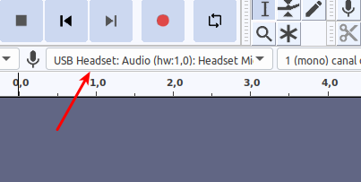

# CAS1 - Àudio

## Plantejament

Es demana:

> Fes una gravació d’àudio pròpia d’entre 1 i 2 minuts de duració i prepara-la amb el format
> adient per penjar-la al web. La volem per fer-la sonar quan passem el ratolí pel damunt de la figura
> de direcció Mrs Heeley.

## Procés de resolució

Utilitzaré la eina open-source [Audacity](https://www.audacityteam.org/).

Per tal que el só s'enregistri amb més puresa, utilitzo uns auriculars amb micròfon.

A l'audacity selecciono el micròfon dels auriculars:

Deixo la freqüència de mostratge a 44100, ja que freqüències inferiors donen una qualitat molt pobre. Inicio l'enregistrament i llegeixo el text.

En el moment de desar, trio el format MP3, que és universalment implementat pels navegadors: Fitxer -> Exporta -> Exporta com a MP3.

## Resultat

El resultat es pot descarregar a [enregistrament àudio](./media/enregistrament.mp3)

