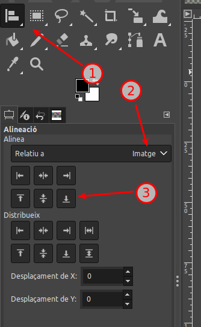
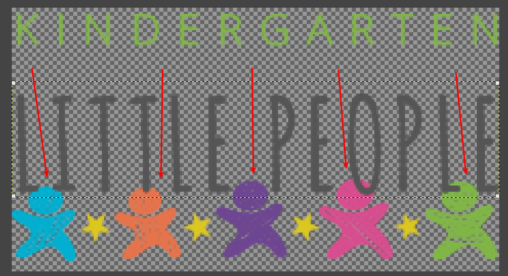
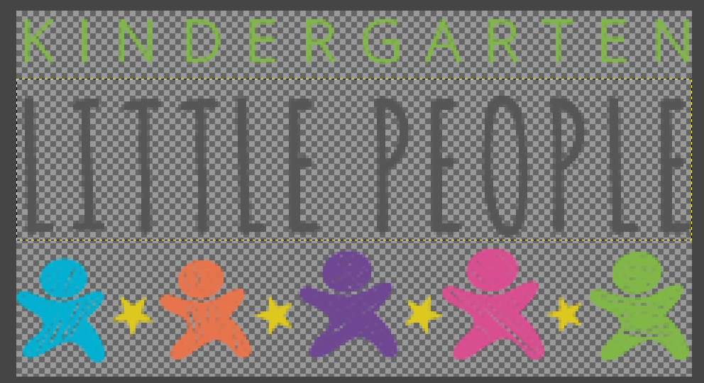
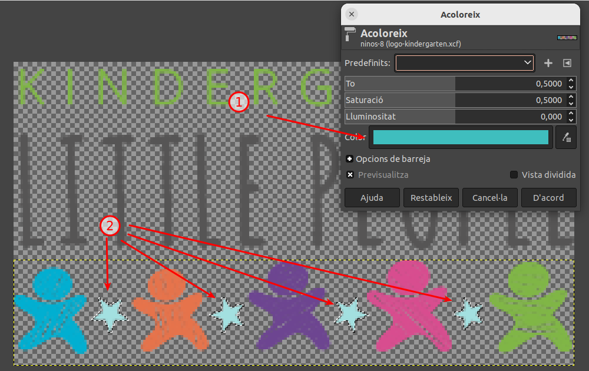
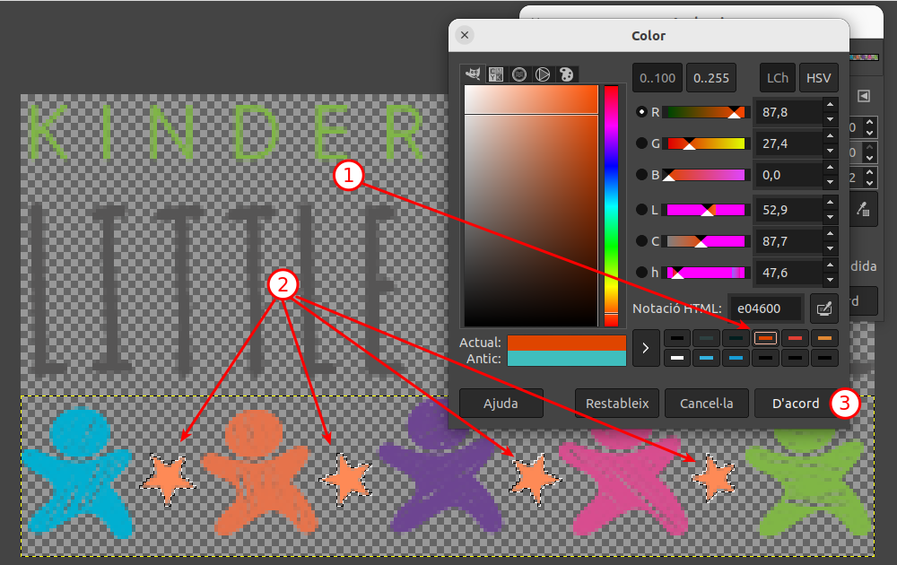

# CAS 1 - Logotip
## Plantejament

Es demanen canvis sobre el logotip:

Els canvis demanats són:

- Les estrelles han de ser taronja i els ninos grisos o negres.
- El text Kindergarten ha d’estar a dalt de tot, al mig el text Little People i a sota el conjunt
  d’estrelles i ninos amb el color canviat.
- El nou logotip ha de tenir la mateixa resolució i mida que el logotip original.

## Procés de resolució

Per a resoldre els canvis demanats al logotip he emprat l'eina Gimp. He seguit el procediment següent:

1. Des del navegador he descarregat el logotip
2. Al Gimp, l'he importat, canviat de nom i desat en el format nadiu de Gimp (xcf)
3. Desprès he duplicat la capa visible (amb tot el contingut) dues vegades, una per a cada part a modificar (a la finestra de capes, botó dret i duplicar capa)
4. He reanomenat les capes segons el contingut desitjat (a la finestra de capes, seleccionar capa i pulsar F2, reanomenar)
   * Kidergarten
   * Little people
   * ninos
5. A la finestra de capes, he desactivat la visió de les capes little people i ninos (a la finestra de capes, picant a sobre de l'ull de cada capa)
6. He seleccionat la primera capa (Kindergarten)
7. Amb l'eina de selecció rectangular, he encerclat el rectangle que correspon al text "Kindergarten", he tingut cura de seleccionar els laterals ajustats a l'amplada de la imatge, per a no canviar la mida
8. Desprès he ajustat la capa a la selecció (Menú capes -> Escapça a la selecció)
9. He desseleccionat (Menú Selecciona -> Res) per a verificar que la capa ha quedat escapçada a la selecció (es veuen els puntets grocs del límit de la capa)
10. He desactivat la visió d'aquesta capa i he activat la visió de la següent: little people
11. He procedit de la mateixa manera que amb la capa anterior
12. Finalment, he procedit de la mateixa manera amb la capa ninos

Un cop tenim aïllats cada element, he procedit a recol·locar-los.

1. He activat la visió de les tres capes (finestra de capes, clicar a l'esquerra del tot de cada nom de capa)
2. He seleccionat la capa dels ninos
3. He seleccionat l'eina "Alinea"
4. A la finestra d'opcions de l'eina, he seleccionat 'aliena', 'respecte de la imatge' i desprès "Alinea amb la vora inferior"

1. Eina d'alineament
2. Relatiu a la imatge
3. Alinea amb la vora inferior

D'aquesta manera, he ubicat els ninos a la part inferior

Desprès he reubicat el text "Kindergarten" amb el mateix procediment, però "Alinea amb la vora superior"

Per últim he reubicat el text "Little People" amb el mateix procediment però amb "Alinea al centre (vertic)"

Donat que el resultat quedava solapat tal i com mostra la imatge

Vaig decidir utilitzar l'eina "Mou" per a reajustar millor les posicions.

Només he de moure la capa "Little People".

Per a evitar lliscaments horitzontals, decideixo utilitzar les fletxes de pujar i baixar del teclat. Primer he de seleccionar la capa per a que el moviment de les tecles s'apliqui a la capa.

Amb el ratolí faig clic sobre la capa, desprès, amb les fletxes, desplaço la capa cap a munt, per a que deixin de solapar-se.

El resultat és el següent:

El següent pas és el canvi de colors. Començo per les estrelles.

1. Selecciono la capa "ninos"
2. Selecciono l'eina "Eina selecció per color", vull aprofitar per a canviar el color a totes les estrelles alhora, ja que no hi ha més elements de color groc.
3. Faig clic al centre de la primera estrella de la esquerra.
4. L'eina selecciona totes les estrelles, amb les vores i tot
5. Tot seguit vaig a canviar el color amb l'eina "Acoloreix": Menu Colors -> Acoloreix
Les estrelles canvien al color per defecte:

6. El color per defecte és blau cel
7. Les estrelles adopten aquest color, tot respectant les opacitats pre-existents

Per poder canviar el color, pico a sobre de la barra de color blau cel (1) i apareix la finestra de selecció de color:

1. Selecciono un taronja
2. Les estrelles adopten aquest color
3. Pico d'acord per a aplicar

La finestra de selecció de color es tanca i confirmo tornant a picar "D'acord" a la finestra de l'eina "Acoloreix". Desprès desselecciono amb "Menú Selecció -> Res".

El procediment per a canviar e color dels ninos és semblant a l'anterior, tot canviant el color taronja per gris i negre alternat. Només hi ha una excepció, en aquest cas, per a seleccionar, en comptes de l'eina de selecció per color, uso l'eina de selecció de regió contínua per color. Sinó, al seleccionar el nino taronja, se seleccionarien també les estrelles.

Un cop aplicat els canvis, procedeixo a exportar la imatge en format PNG. De manera que tant la resolució com la mida romanen inalterades. El resultat final és:

## Resultat

| Original                                            | Canviat                                                      |
| --------------------------------------------------- | ------------------------------------------------------------ |
|  |  |

