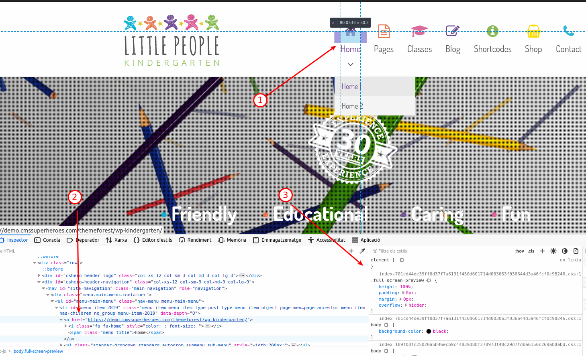
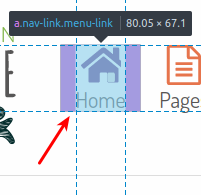
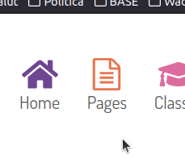
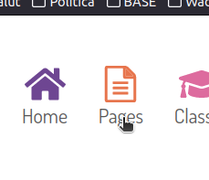

# CAS2 - Integració de contingut interactiu

## Nota prèvia

Amb l'objectiu de desenvolupar el web correctament, s'ha utilitzat un docker amb un nginx "connectat" al port 80 local i amb el directori "CAS2/resolucio-html" com arrel del web. S'ha creat un script de línia de comandes bash (run-web.sh) que engega el contenidor amb els paràmetres d'execucions adients.

## Plantejament

Es demana:

Crea els següents documents .html i .css següents:

- **navegacio.html + navegacio.css**. Crea aquests dos documents mostrant exclusivament el menú de la barra de navegació amb la interacció esmentada al CAS1.
- **serveis.html + serveis.css**. Crea aquests dos documents mostrant exclusivament la secció dels serveis de la llar d’infants i genera una animació d’un gir complet en passar el ratolí per sobre. La rotació s’ha de generar amb codi css exclusivament.
- **direccio.html + direccio.css**. Crea aquests dos documents mostrant exclusivament l’apartat del personal de la llar, en passar el ratolí per sobre la directora Mrs Heeley haurà de sonar la teva gravació.

## Procés de resolució

En tots els casos, he generat un arxiu html i el company css des de zero.

He anat inspeccionant el contingut de la web de mostra amb les eines de desenvolupador del firefox:



1. Amb el punter de l'inspector assenyalo l'element a inspeccionar
2. A la llista del DOM apareix marcat l'element HTML
3. A la esquerra es veuen les propietats CSS

Amb aquesta eina he anat inspeccionant cada part a resoldre i he anat muntant el corresponent codi HTML i el CSS.

He anat codificant i depurant amb un altre navegador, sempre amb finestres d'incògnit per tal de disposar sempre d'una versió sense memòria cau.

També he desactivat la memòria cau per tal d'assegurar-me que cada canvi es reflectia tal i com l'havia codificat.

Com que no s'indicava, he treballat només en dispositiu d'escriptori, sense intentar resoldre-ho en un dispositiu mòbil de cap mida.

Per comoditat, he creat un CSS anomenat "comu.css" per tal d'afegir els estils que utilitzava repetidament entre cadascuna de les pàgines.

### Barra de navegació

He implementat la demanda sense els menús desplegables. Les icones es carreguen amb la propietat CSS *background-image*, de manera que es mostra la imatge de la icona. Com que totes les icones comparteixen estils comuns i només canvia la imatge, he creat un estil comú i un altre específic per a cada icona. A més, en el cas d'algunes icones (home, classes i shop), la relació entre amplada i alçada impedia que es pogués veure correctament amb les mides *quadrades* de les altres icones. Per això he creat un estil addicional que esmena l'amplada:

```css
.svg-icon {
	width: 40px;
	height: 40px;
	background-size: cover;
	background-repeat: no-repeat;
	display: inline-block;
}

.icon-ext {
	width: 45px;
}

.home-icon {
	background-image: url("../images/icones/originals/home.svg");
}
```

L'estil *svg-icon* implementa les propietats comunes: amplada, alçada, com aplicar el fons i com s'ha de mostrar l'element.

L'estil *icon-ext* és la classe per a augmentar l'amplada a les icones que no tenen relació quadrada.

L'estil *home-icon* especifica la imatge per a la icona *Home*.

El canvi d'icona s'estableix amb l'esdeveniment CSS *hover*. En comptes d'implementar-ho directament a la icona (element i), l'he implementat a l'enllaç que la conté. Amb el selector qualificat:

```css
a:hover .home-icon {
	background-image: url("../images/icones/tractades/home.svg");
}
```

Al codi HTML:

```html
<a href="/" aria-current="page" class="nav-link menu-link">
    <i class="home-icon svg-icon"></i>
    <span class="menu-title">Home</span>
</a>
```

Aconsegueixo que la icona canviï quan el ratolí es posiciona a sobre del quadre que forma l'enllaç:



Com es veu a la imatge, el quadre en color lila és l'àrea on s'activarà el canvi d'icona. El resultat és aquest:

| Icona sense passar el ratolí                        | Icona amb el ratolí                              |
| --------------------------------------------------- | ------------------------------------------------ |
|  |  |

El mateix procediment he seguit a la resta d'icones.

### Serveis de la llar d'infants

Per a compondre la pàgina html i el CSS he seguit el mateix procediment que en el cas anterior, però sobre la secció dels serveis.

Les imatges que es mostren no són pas les originals, sinó els GIFs animats creats en la resolució del CAS-1.

Per a implementar el gir, he utilitzat l'esdeveniment *hover* sobre l'element més extern de cada imatge, de manera que el gir es produeix quan el ratolí passa pel quadrat del div amb la classe `vc-col`. L'esdeveniment *hover* de l'element d'aquesta classe, produeix el moviment.

El gir l'he implementat amb la propietat CSS transform, tot utilitzant el mètode "rotate". A més, per tal que la rotació no s'iniciï de seguida, he afegit un retard de *0,3s* i la durada del gir és de *1s*:

```css
.vc-col:hover {
	transform: rotate(360deg);
	transition-property: transform;
	transition-delay: 0.3s;
	transition-duration: 1s;
}
```

* **transform** utilitza el mètode *rotate* per a aconseguir el gir, codificat com 360º
* **transition-property** indica la propietat sobre la qual s'apliquen el retard i la durada
* **transition-delay** estableix el retard en aplicar el canvi, codificat com *0,3s*
* **transition-duration** estableix el temps que durarà el gir, codificat com *1s*

### Direcció

Igual que en els casos anteriors, he seguit el mètode de inspeccionar i traslladar.

En aquest cas, però, no he seguit exactament la mateixa estructura, sinó que la he simplificat una mica.

Per tal de poder implementar la reproducció de l'àudio, he carregat la llibreria queryjs, per a tenir el punt d'entrada que m'asseguri que s'ha carregat el document i està preparat per a interaccionar amb l'usuari:

```html
<script type="text/javascript" src="https://code.jquery.com/jquery-3.6.1.slim.min.js"></script>
```

Així puc afegir el codi que farà la reproducció amb l'element estàndard `audio`. Aquest element l'he situat com a primer element del *body*, de manera que es carregui el més aviat possible:

```html
<body>
    <audio>
        <source src="media/enregistrament.mp3"></source>
        El seu navegador no suporta audio HTML5
    </audio>
    <main>
```

Per a fer la reproducció, decideixo utilitzar un identificador per al selector de l'element sobre el qual implementar el *hover*. Al *div* contenidor de tot el conjunt que forma la senyoreta Heeley, l'he afegit l'id *mrsheeley*, de manera que sigui el *hover* d'aquest element el que engegui la reproducció.

```html
<div id="mrsheeley" class="col-persona">
    <div class="titol-persona">
        <h3>
            <a class="link-persona" title="Mrs Heeley" href="#">Mrs Heeley</a>
        </h3>
    </div>
    <div class="categoria-persona">
        <a class="link-persona" href="#" rel="tag">Principal</a>
    </div>
    <div class="media-persona">
        <a href="#" title="Mrs Heeley">
            
        </a>
    </div>
</div>
```

Prèviament, al *header*, he situat el codi javascript que permet reproduir l'àudio quan es passa el ratolí per sobre de l'element que conté la senyoreta Heeley:

```html
<script type="text/javascript">
    $(document).ready(function () {
        $("#mrsheeley").hover(function () {
            let playPromise = document.getElementsByTagName("audio")[0].play();
            if(playPromise != undefined) {
                playPromise.catch((error) => {
                    if(error.name === "NotAllowedError") {
                        window.alert("Per poder sentir el missatge de Mrs Heeley heu de permetre la reproducció d'àudio!");
                    } else {
                        window.error("No es pot reproduïr el missatge de Mrs Heeley.");
                    }
                });
            }
        }, function () {
            document.getElementsByTagName("audio")[0].pause();
            document.getElementsByTagName("audio")[0].load();
        });
    });
</script>
</head>
```

Amb la funció *ready* m'asseguro que el document està carregat i el navegador preparat per a interaccionar.

El *callback* per a l'esdeveniment *hover* de l'element amb id **mrsheeley** serà el que desencadenarà la reproducció. La funció per a iniciar la reproducció és *play*, aquesta funció retorna una *promise* que permet detectar si la configuració del navegador impedeix de reproduir. Si el nom de l'error és "NotAllowedError", indica que la configuració és *blocar la reproducció*. En aquest cas, mostro un missatge que alerta que per a reproduir s'ha de permetre l'àudio.

En cas que no fos aquest l'error, només pot ser *NotSupportedError*, que indica que el format no està suportat. En principi el format MP3 està plenament suportat en gairebé tots els navegadors, o almenys en les més emprats.

La segona funció afegida a l'esdeveniment *hover*, és la que es crida quan el ratolí surt de l'àrea controlada pel *hover*. En aquest cas, he decidit implementar que s'aturi l'àudio i reiniciar-lo. Així, quan el ratolí surt s'atura el missatge i es prepara per a la propera vegada que torni a entrar el ratolí i es torni a reproduir des del començament.

## Resultat

El codi es troba al github.com:

https://github.com/ofornes/daw-m9-uf2

La web amb la solució del CAS2 es troba instal·lada i visitable a:

https://ofornes.github.io/daw-m9-uf2/


