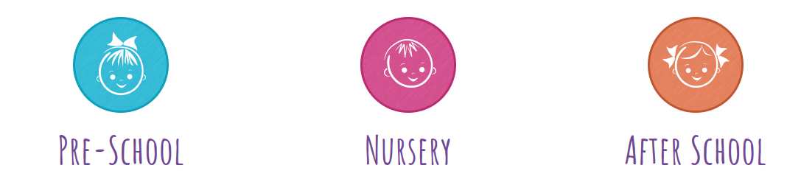
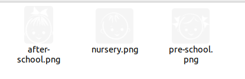
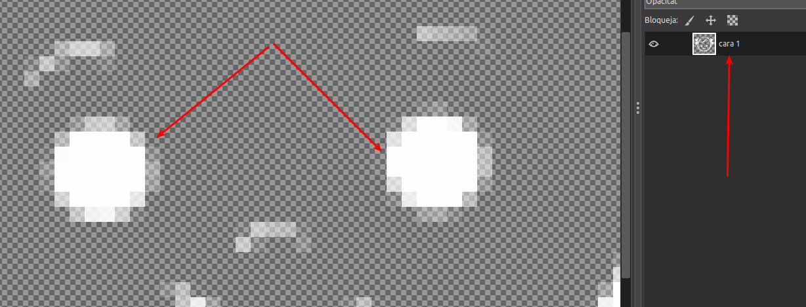
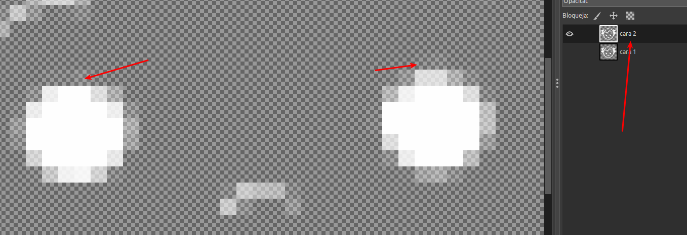
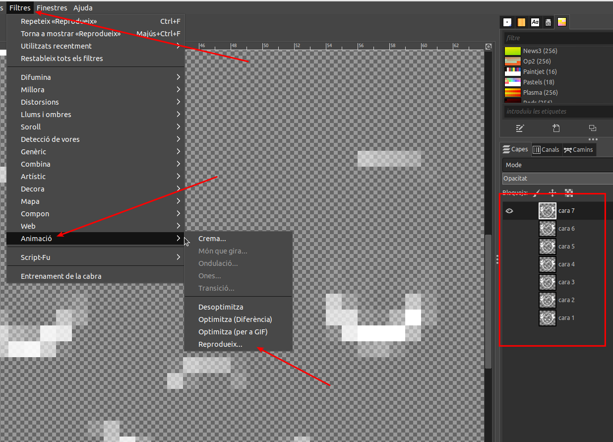
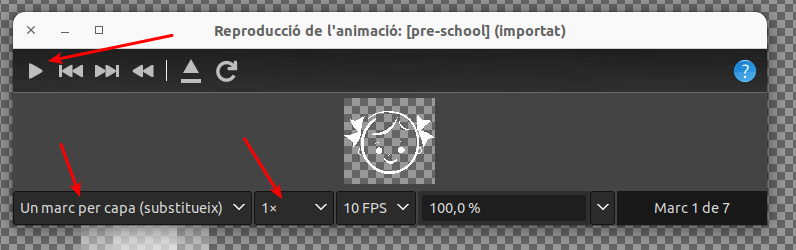
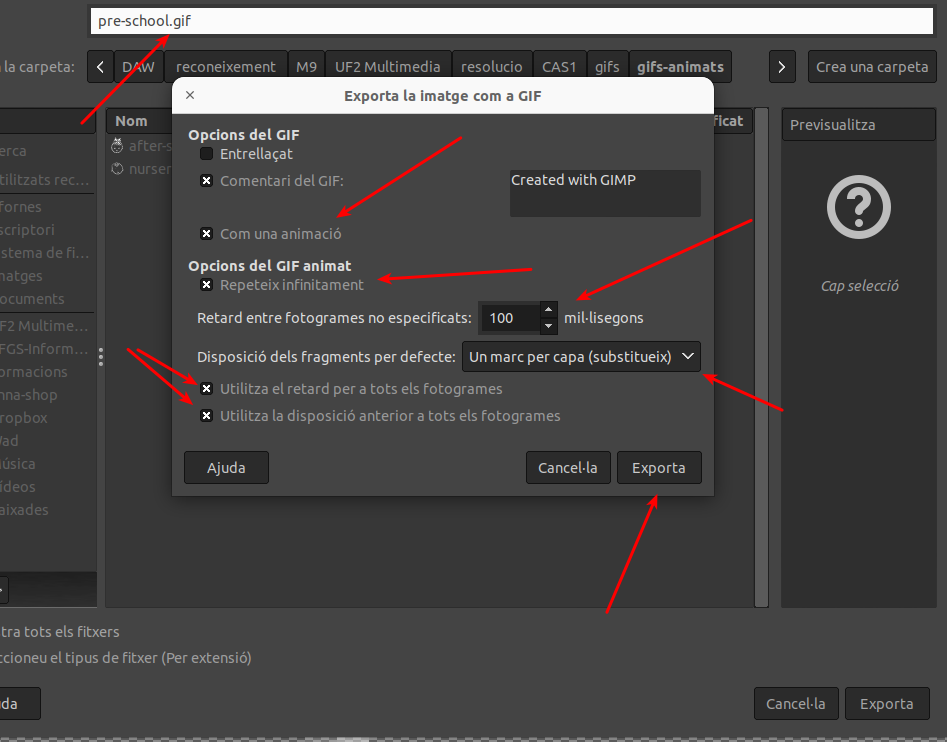
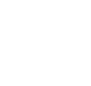
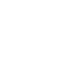

# CAS1 - Serveis de la llar d’infants

## Plantejament

Es demana de descarregar les imatges dels nens que surten a la pàgina i fer un GIF animat per cada servei simulant el pestanyeig d’ulls dels
nens de les imatges. Les imatges originals són les següents:

## Procés de resolució

En primer lloc, he descarregat les imatges originals. Són PNGs que s'utilitzen sobre un fons acolorit amb CSS. Les imatges originals són:

El color de les cares és blanc i el fons transparent.

Tractaré les imatges amb el GIMP, que permet fer gifs animats. La estratègia per a generar el gif és fer l'animació amb substitució de capes, de manera que cada "fotograma" serà una de les capes de la imatge. Començara per la de més abaix i continuarà cap a munt.

Obro la imatge amb el GIMP. La primera capa serà amb els ulls oberts, només he canviar el nom a "cara 1" per a tenir una mica d'ordre:

Ara duplico la capa "cara 1" a la capa "cara 2", oculto la "cara 1" i deixo visible la "cara 2" per a esmenar els ulls fent que sembli que comencen a tancar

A partir d'aquesta situació, només cal anar copiant la darrera capa modificada i esmenar la còpia per tal que els ulls semblin cada cop més tancats per a simular el parpelleig. Desprès d'algunes proves, amb 7 iteracions sembla prou per a simular el parpelleig. Les proves les faig amb el filtre de Gimp "Filtres->Animació->Reprodueig":

El reproductor del gimp també permet de seleccionar paràmetres de reproducció per a visualitzar l'efecte final:

Selecciono substitució de capes, a 1 de velocitat i reprodueixo per a veure l'efecte. Un cop estic satisfet amb el resultat, exporto a gif:

Els paràmetres d'exportació del gif són:

* Com una animació
* Repeteix indefinidament
* 100 mseg entre fotogrames
* Substitució de capes
* Aplicar el retard i disposició a tots els fotogrames

Pico a "Exporta" i deixo la imatge resultant.

## Resultat

**Original**

|  |  |  |
| ----------------------------------------- | ----------------------------------------- | -------------------------------- |

**Resultat**

|  |  |  |
| ----------------------------------------- | ----------------------------------------- | -------------------------------- |

## Nota addicional

Per tal que el resultat final sigui més semblant a l'original, excepte en els canvis demanats, s'ha cercat la mateixa tipografia que s'utilitza en la pàgina: *Amatic SC*. S'ha trobat a Font Squirrel: https://www.fontsquirrel.com/fonts/amatic

