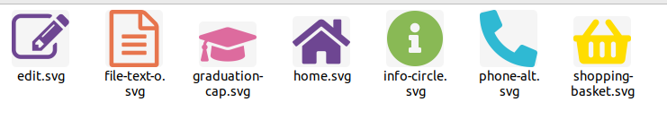
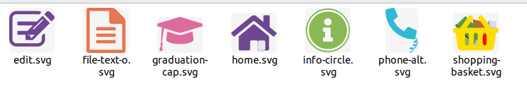

# CAS1 - Barra de navegació

## Plantejament

Descarrega les icones utilitzades a Font Awesome.
Prepara les noves icones vectorials perquè quedin de la següent manera:
* A la casa de Home hi haurà d’aparèixer una porta oberta.
* A la pàgina de Pages se li ha de pintar el cantó que té doblegat.
* Al birret de Classes se li ha de dibuixar la continuació del cordó.
* Al recuadre de Blog hi ha d’aparèixer dos línies.
* S’ha d’afegir un cercle vorejant la icona de Shortcodes.
* El cistell de Shop ha de simular estar ple.
* Al telèfon de Contact se li ha d’afegir un tros de cable.

## Procés de resolució

El primer pas ha estat obtenir les icones corresponents. De les utilitzades a la plantilla, hi ha dos que no es corresponen amb les trobades a FontAwesome: Pages i Blog. Desprès d'una recerca per internet, les he trobat a https://github.com/Rush/Font-Awesome-SVG-PNG.

He agafat les icones que calia i, manualment, he afegit el color que previament he seleccionat amb un "color-picker".

He editat els arxius amb un editor de text i he afegit l'atribut "fill=color" per a que tinguin els mateixos colors que els originals.

Desprès he editat els arxius amb la eina Inkscape, que és un editor vectorial.

En cada cas he fet les modificacions escaients.

## Resultat

* Original

* Tractades

## Nota addicional

Per tal que el resultat final sigui més semblant a l'original, excepte en els canvis demanats, s'ha cercat la mateixa tipografia que s'utilitza en la pàgina: *Dosis*. S'ha trobat a Font Squirrel: https://www.fontsquirrel.com/fonts/dosis

